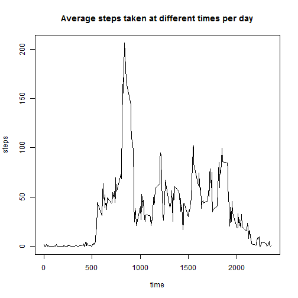

The data was collected through out the day from a personal activity monitoring device.  The data consists of two months of data from October and November, 2012 and include 288 intervals per day (288 = 24 hours X 12 samples per hour), all collected in 5 minute intervals each day.


The text and heading will follow the directions for the project.  First, we need to read in the data and do a quick survey.


```r
# code for project 1 of reproducible research course
activity <- read.csv("f:\\coursera_localrepo\\activity.csv", header=TRUE)
summary(activity)
```

```
##      steps                date          interval     
##  Min.   :  0.00   2012-10-01:  288   Min.   :   0.0  
##  1st Qu.:  0.00   2012-10-02:  288   1st Qu.: 588.8  
##  Median :  0.00   2012-10-03:  288   Median :1177.5  
##  Mean   : 37.38   2012-10-04:  288   Mean   :1177.5  
##  3rd Qu.: 12.00   2012-10-05:  288   3rd Qu.:1766.2  
##  Max.   :806.00   2012-10-06:  288   Max.   :2355.0  
##  NA's   :2304     (Other)   :15840
```

```r
head(activity)
```

```
##   steps       date interval
## 1    NA 2012-10-01        0
## 2    NA 2012-10-01        5
## 3    NA 2012-10-01       10
## 4    NA 2012-10-01       15
## 5    NA 2012-10-01       20
## 6    NA 2012-10-01       25
```

Next the computations for the mean total steps taken per day are done.


```r
  ### mean number of steps per day ###
  
    # aggregate steps by date, using the sum function
    # need date as a factor first, report: mean, median, histogram
  agg <- aggregate(steps~date, activity, sum)
  hist(agg$steps, main = "Histogram of total steps per day", xlab = "steps")
```


```r
  mean(agg$steps)
```

```
## [1] 10766.19
```

```r
  median(agg$steps)
```

```
## [1] 10765
```

The average daily pattern of activity is calculated and plotted.  Also, the index and time of the maximum activity (mean number of steps in a single interval) is performed.


```r
 ### average daily activity pattern  ###
  
  agg2 <- aggregate(steps~interval, activity, mean)  # agg2 holds interval mean steps
  plot(agg2$interval, agg2$steps, type="l", xlab = "time", ylab = "steps", main = "Average steps taken at different times per day")
```



```r
  indexMax <- which(agg2$steps==max(agg2$steps))
  indexMax                    # index of interval with max steps
```

```
## [1] 104
```

```r
  agg2$interval[indexMax]     # time of interval with max steps
```

```
## [1] 835
```

The NA values are now replaced (imputed) with the mean of the other observations taken at the same time interval.


```r
 ### inputing missing values ### 

  
  activityFill<- activity      

    # fill in missing values (NAs) with some value
  indexNA <- which(is.na(activity$steps))
  fillNA <- function(i) {
      j <- which(agg2$interval==activity$interval[i])[1]
      agg2$steps[j]
  }
  
    # fill in NA values with agg2 value which is interval mean 
    # call the resulting data frame activityFill
  activityFill$steps[indexNA] <- sapply(indexNA, fillNA)

  hist(activityFill$steps, xlab = "steps", main = "Histogram of steps with NAs imputed valuesa")
```


```r
  hist(activity$steps, xlab = "steps", main = "Histogram of steps without replacing NAs")
```


```r
  mean(activityFill$steps)
```

```
## [1] 37.3826
```

```r
  median(activityFill$steps)
```

```
## [1] 0
```
Now the difference between activity on weekdays and weekends is calculated and plotted.


```r
 ### weekdays, weekends and activity patterns  ###
  
  
  dayType <- function(x) {
    dayName <- weekdays( as.Date( as.character(x) ) )
    ifelse( (dayName=="Saturday") | (dayName=="Sunday"), "weekend", "weekday" )
    }
  
  typeofDays <- sapply(activityFill$date, dayType)
    # next add a column to activityFill that has a factor of weekend or weekday
  activityPlus <- data.frame(activityFill, typeofDays, stringsAsFactors = TRUE)
    # next plot both weekday and weekend averages
  par(mfrow = c(1,2))
  plot(steps~interval , type="l", data = activityPlus[activityPlus$typeofDays == "weekday",], 
       main = "Weekday Activity", xlab = "5 minute time intervals", ylab = "average steps")
  plot(steps~interval , type="l", data = activityPlus[activityPlus$typeofDays == "weekend",], 
       main = "Weekend Activity", xlab = "5 minute time intervals", ylab = "average steps")
```


